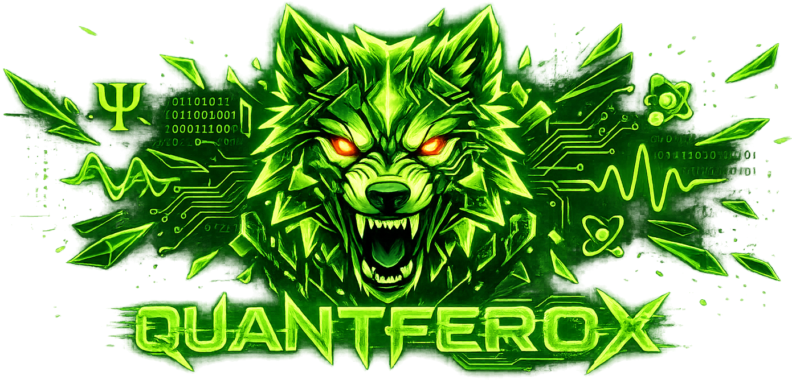

  

 

  

 

---

⚡ &nbsp;<b>Frontend</b> &nbsp;—&nbsp; interfaces that feel inevitable

 

  

 

🛠 &nbsp;<b>Backend & Database</b> &nbsp;—&nbsp; systems built to last

 

  

 

🧬 &nbsp;<b>Languages</b> &nbsp;—&nbsp; tools are secondary, logic is primary

 

  

 

🔧 &nbsp;<b>DevOps & Tooling</b> &nbsp;—&nbsp; the invisible backbone

 

  

 

☁️ &nbsp;<b>Cloud & Platforms</b> &nbsp;—&nbsp; deployed, scaled, delivered

 

  

 

 

---

  

 

  

